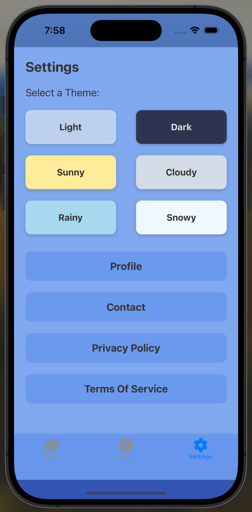
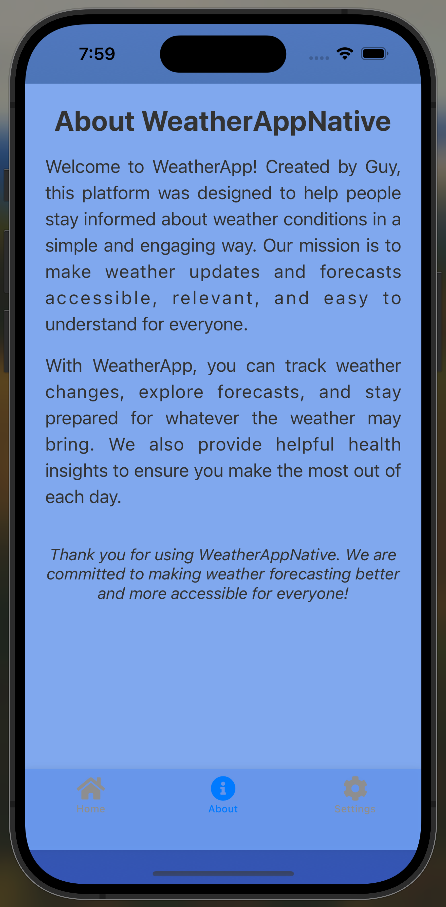
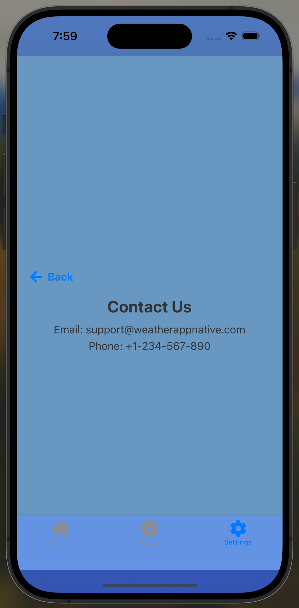
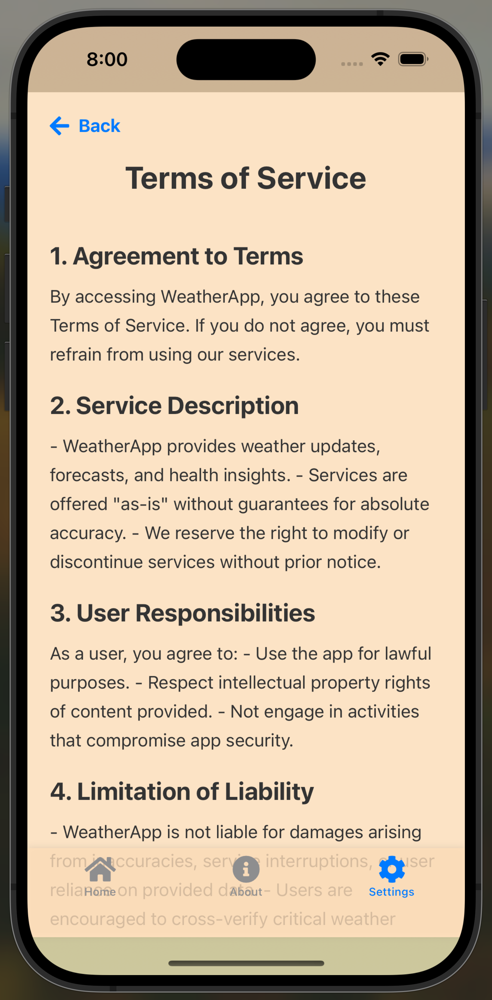

# 🌦️ Weather-App Native

Welcome to **Weather-App Native** – a cross-platform React Native application designed to provide real-time weather updates, forecasts, and more. With a modern UI, dark/light themes, and weather-specific elements, it’s crafted for users who value both functionality and aesthetics. The app includes additional pages like **About**, **Contact**, **Privacy Policy**, and **Terms of Service**.

---

## 📸 Project Overview

**Weather-App Native** empowers users to stay updated on weather changes with real-time information, sleek design, and user-friendly navigation. This app demonstrates the potential of React Native for creating responsive, cross-platform applications for both Android and iOS.

---

## Table of Contents

1. [🌟 Features](#-features)
2. [🛠 Installation](#-installation)
3. [🚀 Usage](#-usage)
4. [📁 Project Structure](#-project-structure)
5. [🧑‍💻 Available Scripts](#-available-scripts)
6. [🌐 API Integration](#-api-integration)
7. [📸 Screenshots](#-screenshots)
8. [🤝 Contributing](#-contributing)
9. [📜 License](#-license)

---

## 🌟 Features

- **Real-Time Weather Data**: Displays current weather, 5-day forecasts, and additional weather parameters.
- **Dark & Light Themes**: The app adapts to user preferences, ensuring a comfortable experience.
- **Cross-Platform**: Runs seamlessly on both Android and iOS devices.
- **Detailed Pages**:
  - **Weather**: Comprehensive weather information.
  - **About**: Insights into the app's creation and purpose.
  - **Contact**: A page for reaching out to developers.
  - **Privacy Policy & Terms of Service**: Clear and concise legal information.
- **Context API for State Management**: Ensures efficient state handling across the app.

---

## 🛠 Installation

### Prerequisites

Ensure you have the following installed:
- [Node.js](https://nodejs.org) (v14 or higher)
- [Expo CLI](https://expo.dev) (for running the app)
- [Git](https://git-scm.com)
- [Android Studio or Xcode](https://developer.android.com/studio / https://developer.apple.com/xcode/) for device emulation.

### Clone the Repository

```bash
git clone https://github.com/Breachfix/WeatherAppNative.git
cd WeatherAppNative
```

### Install Dependencies

```bash
npm install
```

### Environment Variables

Create a .env file in the root directory and add your OpenWeather API key:

```bash
API_KEY=your_openweather_api_key
```

## 🚀 Usage

### Running the Application

Start the development server with Expo:

```bash
npx expo start
```

Run the app on an emulator or physical device:
	•	iOS: Press i to launch the iOS simulator.
	•	Android: Press a to launch the Android emulator.
	•	Expo Go: Scan the QR code with the Expo Go app on your device.

### Building the Application

For creating a standalone app, follow Expo’s documentation on building apps.


### 📁 Project Structure

```bash

WeatherAppNative/
├── assets/                     # Images, icons, and fonts
├── src/
│   ├── components/             # Reusable UI components (e.g., buttons, headers)
│   ├── context/                # Context API for global state
│   ├── pages/                  # Page components (Home, About, Contact, etc.)
│   ├── App.tsx                 # Main app file
│   └── index.tsx               # App entry point
├── .env                        # Environment variables
├── .gitignore                  # Files to ignore in Git
├── app.json                    # Expo configuration
├── package.json                # Dependencies and scripts
└── README.md                   # Project documentation
```

### 🧑‍💻 Available Scripts

	•	Start Development Server: npm start
	•	Run on iOS: npm run ios
	•	Run on Android: npm run android
	•	Build for Production: Follow Expo’s Build Guide.

### 🌐 API Integration

The app uses the OpenWeather API for fetching weather data. You need to add an API key in your .env file as follows:


```bash
API_KEY=your_openweather_api_key
```

### 📸 Screenshots

Screenshots will be added soon to showcase the app’s UI.





### 🤝 Contributing

Contributions are welcome! To contribute:
	1.	Fork the repository.
	2.	Create a new branch.
	3.	Commit your changes.
	4.	Submit a pull request.

### 📜 License

This project is licensed under the MIT License. See LICENSE.md for more details.

Thank you for exploring Weather-App Native! 🌍🌤️🌧️ Enjoy a seamless and delightful weather tracking experience.